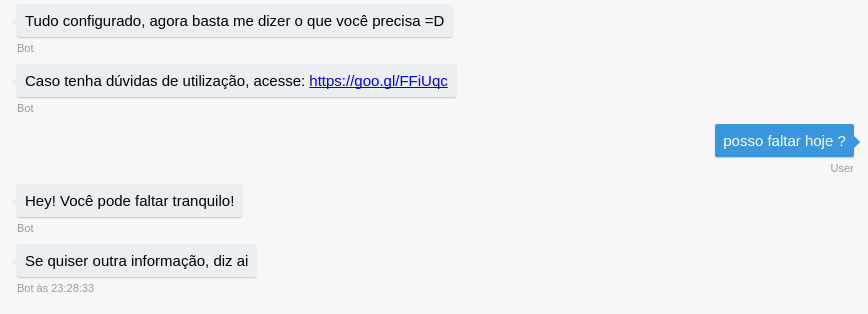
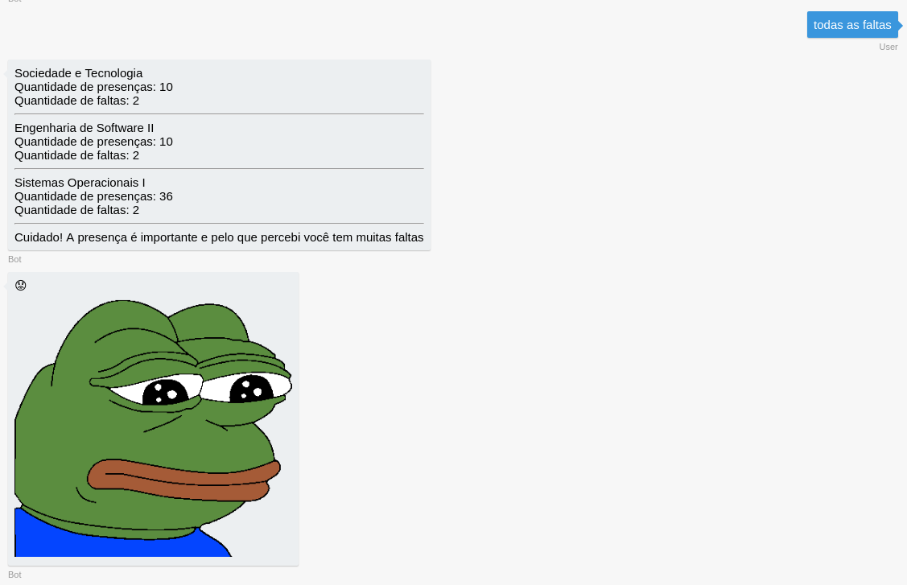
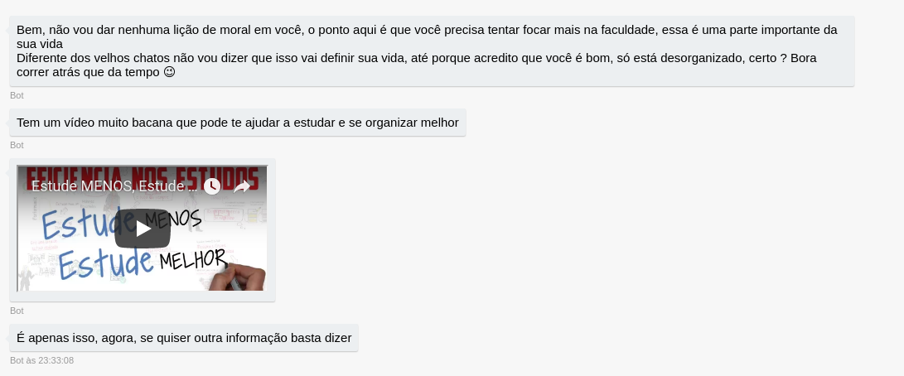

# PossoFaltar Bot

Chatbot que utiliza de NPL baseado em intenções que faz a raspagem de dados do SIGA, para facilitar a interação dos alunos da Fatec com o sistema.

## Funcionalidades :star:

* Consultar todas as faltas;
  * Apresenta dicas para o usuário sobre as faltas.
* Consultar possibilidade de ausência;
* Realizar processamento de linguagem natural
  * Mais liberdade na interação com o usuário;
* Calcula probabilidade de reprovação com base nos pontos positivos e negativos de suas informações;
* Tenta motivar e ajudar o aluno com problemas de auxência.

## Interação :star:

A interação com o bot é feita em uma linguagem informal, sem a necessidade de muitas palavras. Inclusive, este é um bot que gosta de ajudar, e não vê a necessidade de muitas palavras para ajudar os alunos. Porém caso seja necessário, ele pode bater um papo.

### Interagindo com o bot

Abaixo é demonstrado algumas formas de interação que podem ser feitas com o bot.

* Perguntando para o bot se pode ou não faltar no dia em que a mensagem está sendo enviada

* Pedindo para verificar todas as faltas

* O bot vendo a situação de suas faltas, te passa dicas sobre conteúdos para assistir

OBS: Caso seja necessário reiniciar a conversa basta digitar palavras relacionadas como:
* reset;
* recomeçar;
* desde o inicio;
* começar novamente.

Todas essas podem ser usadas a qualquer momento.

### Demonstração de interação e funcionamento

* OBS: Clique na imagem para ver o bot funcionando

## Plataformas :fire:

Por ser feito utilizando o BotFramework, o bot pode ser utilizados em várias plataformas dentre elas:
* Telegram;
* Skype;
* Slack;
* Messeger;
* Bing channel;
* Twilio.

## Técnologias utilizadas :fire:

* BotFramework;
* NodeJS;
* PhantomJS;
* Dialog Flow.

## ToDo :godmode:

- [X] Cálculo probabilístico sobre a reprovação do usuário;
- [X] Porcentagem de presenças;
- [X] Adicionar mais vida aos diálogos.
