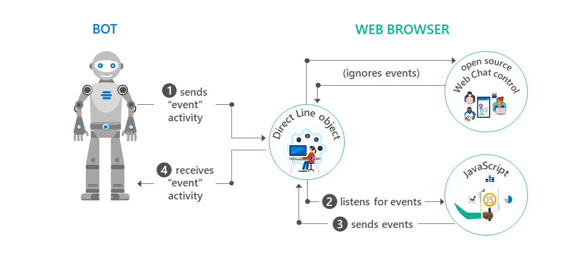

# PossoFaltar Bot

Chatbot em NodeJS capaz de raspar dados do SIGA, para resgatar presenças dos alunos da FATEC utilizando PhantomJS.

## Funcionalidades

* Consultar todas as faltas;
  * Apresenta dicas para o usuário sobre as faltas.
* Consultar possibilidade de ausência;
* Realizar processamento de linguagem natural
  * Mais liberdade na interação com o usuário.

## Demonstração de interação

## Plataformas

Por ser feito utilizando o BotFramework, o bot pode ser utilizados em várias plataformas dentre elas:
* Telegram;
* Skype;
* Slack;
* Facebook Messenger;
* Email.

## ToDo

- [ ] Adicionar banco de dados para armazenar informações do usuário
- [ ] Cálculo probabilístico sobre a reprovação do usuário
- [ ] Porcentagem de presenças
- [ ] Adicionar mais vida aos diálogos
